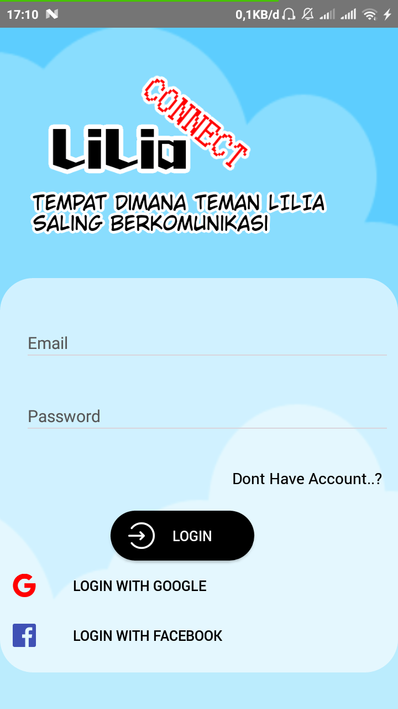
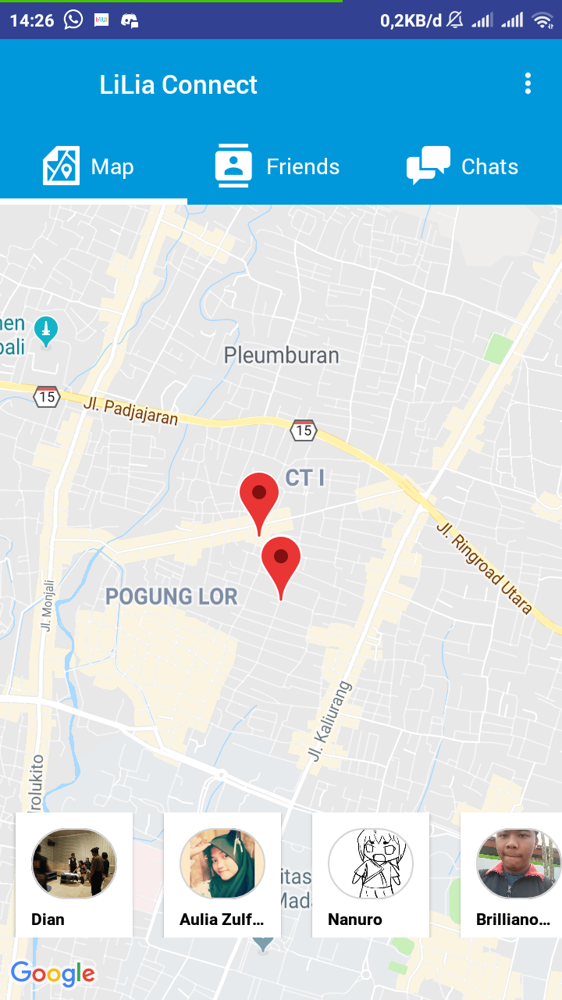
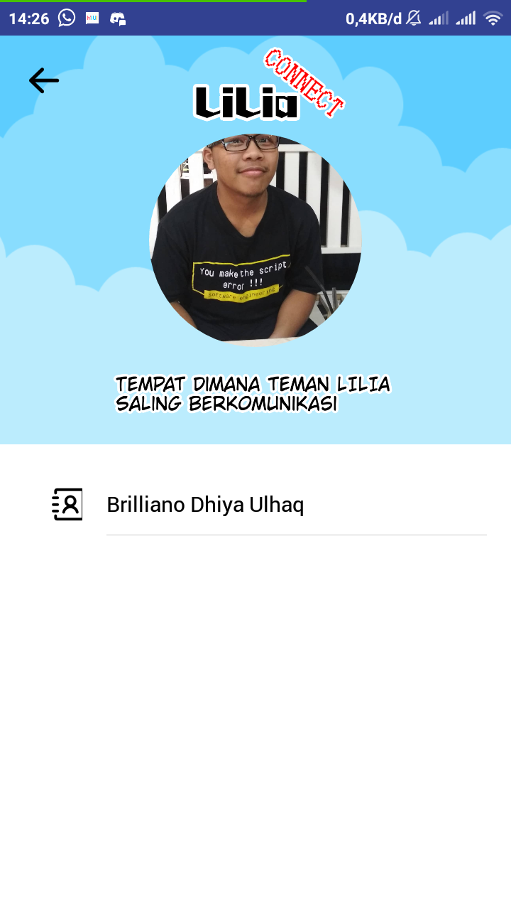
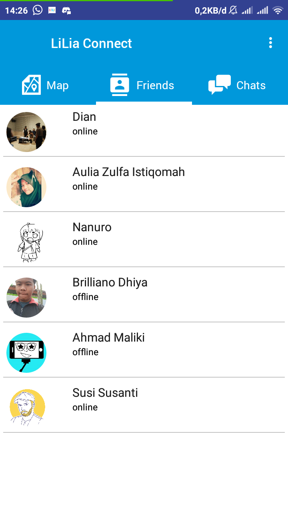
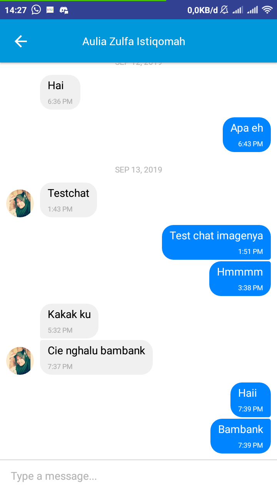

# LiLia Connect App Chat 


> This app is created using react-native and firebase
> I've released this to apk in this [link](https://drive.google.com/file/d/1sbhWxPB94RSRiMrZM90EXZzdvjR2Tk6C/view?usp=sharing)

## Features

* Realtime chat using firebase
* Show location of your friends
* Show list friend
* Show Profile

## Used Technology

* [React-Native](https://facebook.github.io/react-native/)
* [Firebase](https://console.firebase.google.com)
* [NativeBase](https://nativebase.io/)
* [Maps API](https://cloud.google.com/maps-platform/)

## How to run this app locally

* Clone this Repository
* Run
  ```sh
  npm install
  ```
  or
  ```sh
  yarn install
  ```
* Make sure USB pluged in and your device is in debug mode
* If you use Android Run:
  ```sh
  react-native run-android
  ```
  If use IOS Run:
  ```sh
  react-native run-ios
  ```
```diff
! if running error try reinstall the react-native same version with this app
```

## The idea behind this project 


This project is made by React-Native with Backend Firebase and this project inspirated by my Comic Project [LiLia Sekai](https://www.instagram.com/lilia_sekai/). By this app hoped that can help fans LiLia can be connected by chat or distance from that i've make this app name with LiLia Connect

## Screenshot 

<kbd>

</kbd>

<kbd>

</kbd>

<kbd>

</kbd>

<kbd>

</kbd>

<kbd>

</kbd>